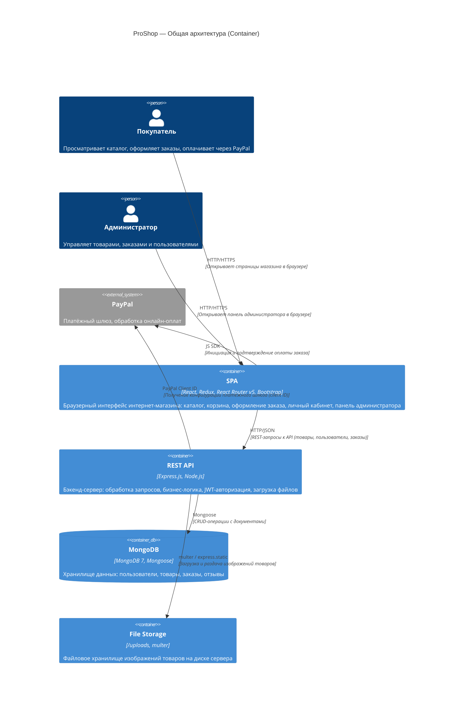
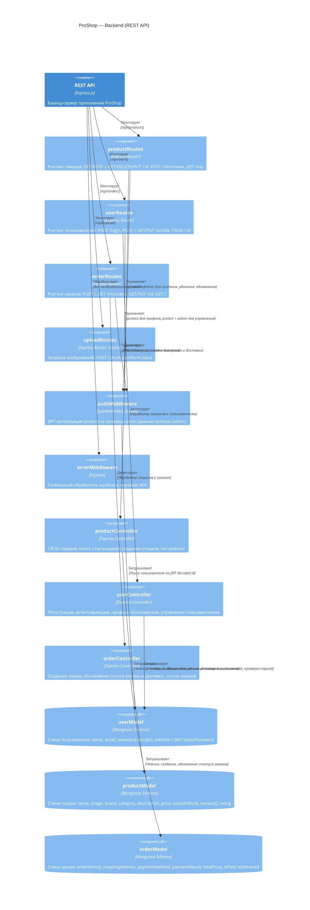
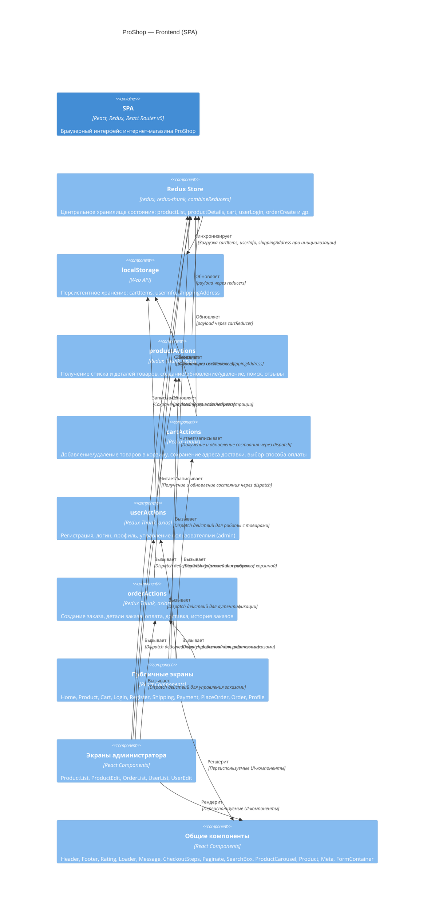

# ProShop MERN — Архитектура

## Уровень Container

```mermaid
C4Container
    title ProShop — Общая архитектура (Container)

    Person(customer, "Покупатель", "Просматривает каталог, оформляет заказы, оплачивает через PayPal")
    Person(admin, "Администратор", "Управляет товарами, заказами и пользователями")

    System_Ext(paypal, "PayPal", "Платёжный шлюз, обработка онлайн-оплат")

    Container(spa, "SPA", "React, Redux, React Router v5, Bootstrap", "Браузерный интерфейс интернет-магазина: каталог, корзина, оформление заказа, личный кабинет, панель администратора")
    Container(api, "REST API", "Express.js, Node.js", "Бэкенд-сервер: обработка запросов, бизнес-логика, JWT-авторизация, загрузка файлов")
    ContainerDb(db, "MongoDB", "MongoDB 7, Mongoose", "Хранилище данных: пользователи, товары, заказы, отзывы")
    Container(files, "File Storage", "/uploads, multer", "Файловое хранилище изображений товаров на диске сервера")

    Rel(customer, spa, "HTTP/HTTPS", "Открывает страницы магазина в браузере")
    Rel(admin, spa, "HTTP/HTTPS", "Открывает панель администратора в браузере")
    Rel(spa, api, "HTTP/JSON", "REST-запросы к API (товары, пользователи, заказы)")
    Rel(spa, paypal, "JS SDK", "Инициация и подтверждение оплаты заказа")
    Rel(api, db, "Mongoose", "CRUD-операции с документами")
    Rel(api, files, "multer / express.static", "Загрузка и раздача изображений товаров")
    Rel(api, paypal, "PayPal Client ID", "Получение конфигурации платёжного шлюза (client ID)")
```

## Backend — Компоненты

```mermaid
C4Component
    title ProShop — Backend (REST API)

    Container(api, "REST API", "Express.js", "Бэкенд-сервер приложения ProShop")

    Component(productRoutes, "productRoutes", "Express Router", "Роутинг товаров: GET/POST /, GET/DELETE/PUT /:id, POST /:id/reviews, GET /top")
    Component(userRoutes, "userRoutes", "Express Router", "Роутинг пользователей: POST /login, POST /, GET/PUT /profile, CRUD /:id")
    Component(orderRoutes, "orderRoutes", "Express Router", "Роутинг заказов: POST /, GET /myorders, GET/PUT /:id, GET /")
    Component(uploadRoutes, "uploadRoutes", "Express Router, multer", "Загрузка изображений: POST / (multipart/form-data)")

    Component(authMiddleware, "authMiddleware", "jsonwebtoken, bcrypt", "JWT-авторизация (protect) и проверка роли администратора (admin)")
    Component(errorMiddleware, "errorMiddleware", "Express", "Глобальный обработчик ошибок и перехват 404")

    Component(productController, "productController", "Express Controller", "CRUD товаров, поиск с пагинацией, создание отзывов, топ-рейтинг")
    Component(userController, "userController", "Express Controller", "Регистрация, аутентификация, профиль пользователя, управление пользователями")
    Component(orderController, "orderController", "Express Controller", "Создание заказа, обновление статуса оплаты и доставки, список заказов")

    ComponentDb(userModel, "userModel", "Mongoose Schema", "Схема пользователя: name, email, password (bcrypt), isAdmin + JWT matchPassword")
    ComponentDb(productModel, "productModel", "Mongoose Schema", "Схема товара: name, image, brand, category, description, price, countInStock, reviews[], rating")
    ComponentDb(orderModel, "orderModel", "Mongoose Schema", "Схема заказа: orderItems[], shippingAddress, paymentMethod, paymentResult, totalPrice, isPaid, isDelivered")

    Rel(api, productRoutes, "Монтирует", "/api/products")
    Rel(api, userRoutes, "Монтирует", "/api/users")
    Rel(api, orderRoutes, "Монтирует", "/api/orders")
    Rel(api, uploadRoutes, "Монтирует", "/api/upload")
    Rel(api, errorMiddleware, "Обрабатывает", "Все необработанные ошибки")

    Rel(productRoutes, authMiddleware, "Применяет", "protect + admin для создания, удаления, обновления")
    Rel(userRoutes, authMiddleware, "Применяет", "protect для профиля, protect + admin для управления")
    Rel(orderRoutes, authMiddleware, "Применяет", "protect для всех, + admin для списка и доставки")

    Rel(productRoutes, productController, "Делегирует", "Обработку запросов к товарам")
    Rel(userRoutes, userController, "Делегирует", "Обработку запросов к пользователям")
    Rel(orderRoutes, orderController, "Делегирует", "Обработку запросов к заказам")

    Rel(productController, productModel, "Запрашивает", "Чтение, создание, обновление, удаление товаров и отзывов")
    Rel(userController, userModel, "Запрашивает", "Чтение, создание, обновление, удаление пользователей, проверка пароля")
    Rel(orderController, orderModel, "Запрашивает", "Чтение, создание, обновление статуса заказов")

    Rel(authMiddleware, userModel, "Запрашивает", "Поиск пользователя по JWT decoded id")
```

## Frontend — Компоненты

```mermaid
C4Component
    title ProShop — Frontend (SPA)

    Container(spa, "SPA", "React, Redux, React Router v5", "Браузерный интерфейс интернет-магазина ProShop")

    Component(reduxStore, "Redux Store", "redux, redux-thunk, combineReducers", "Центральное хранилище состояния: productList, productDetails, cart, userLogin, orderCreate и др.")
    Component(localStorage, "localStorage", "Web API", "Персистентное хранение: cartItems, userInfo, shippingAddress")

    Component(productActions, "productActions", "Redux Thunk, axios", "Получение списка и деталей товаров, создание/обновление/удаление, поиск, отзывы")
    Component(cartActions, "cartActions", "Redux Thunk", "Добавление/удаление товаров в корзину, сохранение адреса доставки, выбор способа оплаты")
    Component(userActions, "userActions", "Redux Thunk, axios", "Регистрация, логин, профиль, управление пользователями (admin)")
    Component(orderActions, "orderActions", "Redux Thunk, axios", "Создание заказа, детали заказа, оплата, доставка, история заказов")

    Component(publicScreens, "Публичные экраны", "React Components", "Home, Product, Cart, Login, Register, Shipping, Payment, PlaceOrder, Order, Profile")
    Component(adminScreens, "Экраны администратора", "React Components", "ProductList, ProductEdit, OrderList, UserList, UserEdit")

    Component(sharedComponents, "Общие компоненты", "React Components", "Header, Footer, Rating, Loader, Message, CheckoutSteps, Paginate, SearchBox, ProductCarousel, Product, Meta, FormContainer")

    Rel(publicScreens, reduxStore, "Читает/записывает", "Получение и обновление состояния через dispatch")
    Rel(adminScreens, reduxStore, "Читает/записывает", "Получение и обновление состояния через dispatch")
    Rel(publicScreens, productActions, "Вызывает", "Dispatch действий для работы с товарами")
    Rel(publicScreens, cartActions, "Вызывает", "Dispatch действий для работы с корзиной")
    Rel(publicScreens, userActions, "Вызывает", "Dispatch действий для аутентификации")
    Rel(publicScreens, orderActions, "Вызывает", "Dispatch действий для работы с заказами")
    Rel(adminScreens, productActions, "Вызывает", "Dispatch действий для управления товарами")
    Rel(adminScreens, userActions, "Вызывает", "Dispatch действий для управления пользователями")
    Rel(adminScreens, orderActions, "Вызывает", "Dispatch действий для управления заказами")

    Rel(productActions, reduxStore, "Обновляет", "payload через reducers")
    Rel(cartActions, reduxStore, "Обновляет", "payload через cartReducer")
    Rel(userActions, reduxStore, "Обновляет", "payload через userReducers")
    Rel(orderActions, reduxStore, "Обновляет", "payload через orderReducers")

    Rel(publicScreens, sharedComponents, "Рендерит", "Переиспользуемые UI-компоненты")
    Rel(adminScreens, sharedComponents, "Рендерит", "Переиспользуемые UI-компоненты")

    Rel(reduxStore, localStorage, "Синхронизирует", "Загрузка cartItems, userInfo, shippingAddress при инициализации")
    Rel(cartActions, localStorage, "Записывает", "Обновление cartItems и shippingAddress")
    Rel(userActions, localStorage, "Записывает", "Сохранение userInfo при логине/регистрации")
```